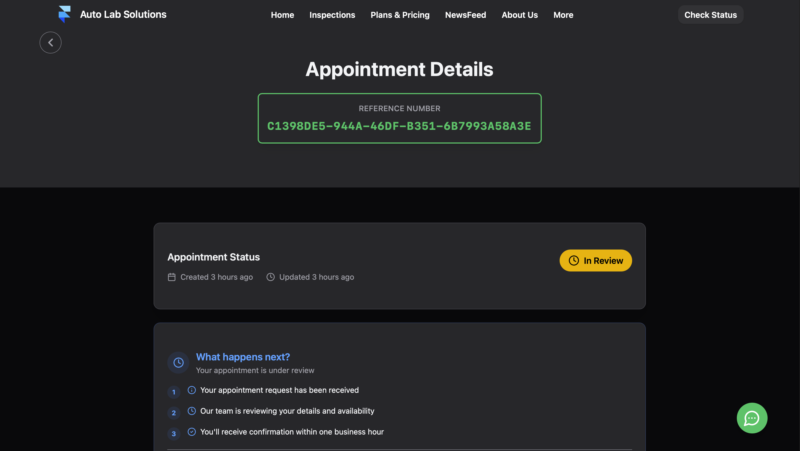

# 🚗 Auto Lab Solutions - Web Frontend

<p align="center">
  
  
  
  
</p>

---

## 📋 Table of Contents

- [🌟 Features Overview](#-features-overview)
- [🏠 Homepage Features](#-homepage-features)
- [📅 Booking System](#-booking-system)
- [💳 Payment Processing](#-payment-processing)
- [💬 Real-time Chat System](#-real-time-chat-system)
- [📊 Admin Dashboard](#-admin-dashboard)
- [🔍 Inspection Services](#-inspection-services)
- [📱 Mobile Optimized](#-mobile-optimized)
- [🛠️ Technical Stack](#️-technical-stack)
- [🚀 Getting Started](#-getting-started)
- [📁 Project Structure](#-project-structure)
- [🌐 Environment Setup](#-environment-setup)

---

## 🌟 Features Overview

Auto Lab Solutions is a comprehensive web application designed for automotive inspection and mobile repair services in Perth, Australia. The platform combines modern web technologies with intuitive user experience to deliver professional automotive services.

### 🎯 Core Services

- **🔍 Pre-Purchase Car Inspections** - Comprehensive vehicle assessments
- **🔋 Mobile Battery Replacement** - On-site battery services
- **📋 Logbook & Services** - Maintenance and service records
- **⚙️ Engine Tuneup** - Performance optimization
- **🎨 Paint Correction** - Professional detailing services

---

## 🏠 Homepage Features


### 🎬 Dynamic Hero Section
- **Parallax Video Background** with mobile-optimized slideshow
- **Interactive Service Cards** with hover animations
- **Google Ratings Display** with 5-star customer reviews
- **Call-to-Action Buttons** for instant booking


### 👥 Company Information
- **About Us Section** with professional presentation
- **Team Introduction** with certified mechanics
- **Service Coverage Areas** across Perth metropolitan


### ✨ Why Choose Us
- **Expert Technicians** with 8+ years experience  
- **Advanced Equipment** for comprehensive diagnostics
- **Transparent Reporting** with detailed findings
- **Flexible Scheduling** to fit your needs


### ⭐ Customer Reviews
- **Real Google Reviews Integration**
- **Star Rating Display** with review count
- **Customer Testimonials** showcase


### 🛠️ Services Showcase
- **Interactive Service Cards** with background images
- **Hover Effects** and smooth transitions
- **Direct Navigation** to service booking


### ❓ FAQ Section
- **Expandable Question Cards** with detailed answers
- **Common Inquiries** about inspection process
- **Payment & Scheduling** information


### 📞 Contact Integration
- **Google Maps Integration** for location finding
- **Multiple Contact Methods** (phone, email, form)
- **Business Hours** and service area display

---

## 📅 Booking System

The booking system implements a comprehensive 4-step workflow for seamless appointment scheduling:

### Step 1: Service Plan Selection


**Features:**
- 🎯 **Service Categories** - Pre-purchase inspections, mobile repairs, maintenance
- 💰 **Tiered Pricing Plans** - Standard, Comprehensive, Advanced diagnostic options
- ✅ **Feature Comparison** - Detailed breakdown of what's included
- 📊 **Duration Estimates** - Clear time expectations (2-4 hours)
- 🔄 **Plan Navigation** - Easy switching between service types

### Step 2: Booking Form


**Comprehensive Data Collection:**
- 👤 **Customer Information**
  - Buyer details (name, email, phone)
  - Seller information (for inspections)
  - Smart form validation with real-time feedback

- 🚗 **Vehicle Details**
  - Make, model, year selection
  - Vehicle location for mobile service
  - Additional notes and special requests

- 🔍 **Inspection Type Toggle**
  - Buyer vs. customer mode switching
  - Conditional field display
  - Form state persistence

### Step 3: Time Slot Selection


**Intelligent Scheduling:**
- 📅 **Calendar Interface** - Interactive date picker with Perth timezone
- ⏰ **Dynamic Time Slots** - Generated based on service duration
- 🎯 **Multiple Selection** - Choose up to 3 preferred time slots
- 🔄 **Drag & Drop Reordering** - Prioritize your preferred times
- ✨ **Smart Recommendations** - AI-suggested optimal slots


**Advanced Features:**
- 🤖 **AI Slot Recommendations** - Machine learning optimized suggestions
- 📊 **Availability Analytics** - Real-time mechanic availability
- 🚫 **Conflict Detection** - Prevents double-booking
- ⚡ **2-Hour Notice** - Minimum booking window enforcement

### Step 4: Booking Confirmation


**Review & Confirm:**
- 📋 **Complete Summary** - All booking details in one view
- 💼 **Service Information** - Selected plan and pricing
- 📞 **Contact Details** - Buyer and seller information  
- 🚗 **Vehicle Summary** - Car details and location
- ⏰ **Selected Time Slots** - Prioritized time preferences
- ✅ **Final Confirmation** - Submit appointment request


**Success State:**
- 🎉 **Confirmation Message** - Appointment successfully created
- 📧 **Email Notification** - Confirmation sent to customer
- 🔍 **Status Tracking** - Direct link to appointment status
- 📱 **Mobile Responsive** - Optimized for all devices

---

## 💳 Payment Processing

### 🔐 Secure Stripe Integration


**Payment Features:**
- 💳 **Multiple Payment Methods** - Credit/debit cards, digital wallets
- 🔒 **SSL Encryption** - 256-bit security for all transactions
- 💰 **Dynamic Pricing** - Real-time calculation based on selected services
- 📧 **Payment Receipts** - Automatic email confirmations
- 🔄 **Payment Status Tracking** - Real-time payment state updates

**Payment Workflow:**
1. **Payment Intent Creation** - Secure server-side processing
2. **Card Information Entry** - Stripe Elements integration
3. **Payment Confirmation** - Real-time validation
4. **Receipt Generation** - Automated documentation
5. **Status Updates** - Appointment status synchronization

### 💰 Payment Status Management


**Unpaid State:**
- ⚠️ **Payment Required Notice** - Clear status indication
- 🔗 **Pay Now Button** - Direct payment initiation
- ⏰ **Slot Availability Check** - Pre-payment validation
- 📱 **Mobile Optimized** - Responsive payment interface


**Paid State:**
- ✅ **Payment Completed** - Success confirmation
- 📄 **Receipt Information** - Payment method and date
- 🔒 **Secure Transaction** - Stripe payment verification
- 📊 **Status Updates** - Automatic appointment progression

---

## 💬 Real-time Chat System


### 🌐 WebSocket-Powered Messaging

**Real-time Features:**
- 💬 **Instant Messaging** - Live chat with support agents
- 📱 **Message Notifications** - Pop-up alerts for new messages
- 👀 **Read Receipts** - Message delivery confirmation
- ⌨️ **Typing Indicators** - Real-time typing status
- 🔔 **Unread Count Badge** - Visual notification system


**Notification System:**
- 🚨 **Desktop Notifications** - Non-intrusive alerts
- 📲 **Mobile Alerts** - Touch-optimized notifications
- 🔕 **Do Not Disturb** - Configurable notification settings
- 📝 **Message Preview** - Quick message content display

**Technical Implementation:**
- 🔗 **WebSocket Connection** - Real-time bidirectional communication
- 💾 **Message Persistence** - Local storage and server synchronization
- 🔄 **Connection Recovery** - Automatic reconnection handling
- 📊 **Message Status Tracking** - Sent, delivered, read states

---

## 📊 Admin Dashboard

### 🕐 Timeslot Analyzer


**Timeslot Management:**
- 📅 **Date Selection** - Today, tomorrow, custom date picker
- ⏱️ **Duration Configuration** - 30 mins to 3+ hours slots
- 🎨 **Visual Slot Status** - Color-coded availability indicators
- 🤖 **Recommendations** - Optimized scheduling suggestions
- 📊 **Real-time Updates** - Live availability tracking


**Analytics Dashboard:**
- 📈 **Capacity Analysis** - Maximum appointment potential
- 📊 **Utilization Rates** - Current vs. maximum capacity
- 👨‍🔧 **Mechanic Availability** - Real-time staff tracking
- 🎯 **Optimization Insights** - Data-driven scheduling recommendations

**Visual Indicators:**
- 🟢 **Available Slots** - Ready for booking
- 🔴 **Fully Booked** - No capacity remaining  
- 🟡 **Too Soon** - Within 2-hour notice window
- ⭐ **Recommended** - AI-optimized suggestions
- ❌ **Manually Unavailable** - Admin-blocked slots

---

## 🔍 Inspections Page

### 🔬 Inspection Features Section


### 🔧 What Sets Us Apart


---

## 📱 Mobile Optimized

### 📱 Responsive Design

**Mobile-First Approach:**
- 📱 **Touch-Optimized Interface** - Finger-friendly buttons and inputs
- 🔄 **Swipe Gestures** - Intuitive mobile navigation
- 📏 **Adaptive Layouts** - Content reshapes for screen sizes
- ⚡ **Fast Loading** - Optimized images and code splitting
- 🎯 **Mobile Booking Flow** - Streamlined mobile experience

**Cross-Device Features:**
- 📱 **iOS & Android Support** - Progressive Web App capabilities
- 💻 **Desktop Enhancement** - Full-featured desktop experience  
- 🖥️ **Tablet Optimization** - Perfect medium-screen layouts
- 🔄 **Seamless Sync** - Cross-device data synchronization

---

## 📈 Status Tracking System

### 🔍 Check Status Feature


**Multi-Search Capability:**
- 🔍 **Smart Search** - Find appointments by multiple criteria
- 📧 **Email Search** - Customer or seller email lookup
- 📞 **Phone Search** - Contact number identification
- 🚗 **Vehicle Search** - Car make, model, year filtering
- 🏷️ **Reference Search** - Appointment ID tracking


**Advanced Filtering:**
- 📅 **Date Range Filter** - Custom date selection
- 📊 **Status Filter** - Pending, confirmed, completed states
- 💰 **Payment Filter** - Paid, unpaid, processing status
- 🔄 **Real-time Updates** - Live status synchronization


**Status Cards Display:**
- 📋 **Appointment Overview** - Service type, plan, pricing
- ⏰ **Scheduling Information** - Date, time, duration
- 💳 **Payment Status** - Clear payment state indicators
- 📞 **Contact Integration** - Quick call/email buttons
- 📍 **Location Details** - Service address information

### 📄 Appointment Details



**Comprehensive Status View:**
- 🎯 **Reference Number** - Large, prominent display
- 📊 **Status Indicators** - Visual status representation
- 📅 **Timeline Information** - Created, updated timestamps
- 🔄 **Progress Tracking** - Current appointment stage


**Integrated Communication:**
- 📞 **Direct Call Button** - One-tap phone calling
- 📧 **Email Integration** - Quick email composition
- 💬 **Live Chat Access** - Real-time support connection
- 🆘 **Emergency Contact** - Priority support access

### 📋 Inspection Reports


---

## 🏢 About Us & Contact

### 👥 About Us - Mechanics


**Professional Team Showcase:**
- 👨‍🔧 **Lead Technician Profile** - 8+ years experience
- 🏆 **Qualifications Display** - Certified and insured
- 📍 **Service Coverage** - Metropolitan area coverage
- 🔗 **LinkedIn Integration** - Professional network links

### 📞 Contact Us


**Multiple Contact Methods:**
- 🗺️ **Google Maps Integration** - Interactive location finder
- 📍 **Business Address** - Physical location details
- 📞 **Phone Integration** - Click-to-call functionality
- 📧 **Email Contact** - Direct email composition
- 📝 **Contact Form** - Structured inquiry submission
- ⏰ **Business Hours** - Operating time display

---

## 🛠️ Technical Stack

### 🎨 Frontend Framework
- **⚛️ React 18.3.1** - Modern React with Hooks and Context
- **⚡ Vite 5.4.1** - Fast build tool and development server
- **🎭 Framer Motion 11.18.2** - Smooth animations and transitions
- **🧭 React Router 7.6.0** - Client-side routing

### 🎨 UI/UX Libraries
- **🌊 Tailwind CSS 4.1.8** - Utility-first CSS framework
- **🎯 Radix UI** - Accessible component primitives
- **🎨 Tailwind Variants** - Component styling variants
- **✨ Keen Slider** - Touch-friendly carousels
- **🚀 Lenis** - Smooth scrolling library

### 💳 Payment & Communication
- **💰 Stripe React** - Secure payment processing
- **🔗 WebSocket** - Real-time communication
- **📡 Axios** - HTTP client for API calls
- **📱 React Spinners** - Loading indicators

### 🛠️ Utility Libraries
- **📅 date-fns** - Date manipulation utilities
- **🆔 UUID** - Unique identifier generation
- **📄 html2pdf.js** - PDF generation capability
- **🔍 UA Parser** - User agent parsing

### 🎯 Developer Experience
- **📋 ESLint** - Code quality and consistency
- **🎨 Autoprefixer** - CSS vendor prefixing
- **⚡ Vite plugins** - React and TypeScript support

---

## 🚀 Getting Started

### 📋 Prerequisites

- **Node.js** (v16 or higher)
- **npm** or **yarn** package manager
- **Git** for version control

### 📦 Installation

1. **Clone the repository:**
```bash
git clone https://github.com/Auto-Lab-Solutions/Web-Frontend.git
cd Web-Frontend
```

2. **Install dependencies:**
```bash
npm install
# or
yarn install
```

3. **Set up environment variables:**
```bash
cp .env.example .env.local
```

4. **Configure environment variables in `.env.local`:**
```env
VITE_API_GATEWAY_BASE_URL=your_api_endpoint
VITE_WEB_SOCKET_BASE_URL=your_websocket_endpoint
VITE_STRIPE_PUBLISHABLE_KEY=your_stripe_key
VITE_MAIL_FROM_ADDRESS=your_email_address
```

5. **Start development server:**
```bash
npm run dev
# or
yarn dev
```

6. **Open in browser:**
Navigate to `http://localhost:5173`

### 🏗️ Build for Production

```bash
# Build the project
npm run build

# Preview production build
npm run preview
```

---

## 📁 Project Structure

```
Auto-Lab-Solutions/Web-Frontend/
├── 📁 public/                    # Static assets
│   ├── 🖼️ avatars/              # User profile images
│   ├── 🎬 desktopSlideshow/      # Desktop carousel images  
│   ├── 📱 mobileSlideshow/       # Mobile carousel images
│   ├── 🔧 mechanics/            # Team member photos
│   └── 🛠️ services/             # Service category images
├── 📁 src/
│   ├── 📁 components/           # Reusable UI components
│   │   ├── 🏠 home/            # Homepage-specific components
│   │   ├── 🔧 common/          # Shared components
│   │   ├── 💳 payment/         # Payment-related components
│   │   ├── 🎯 contexts/        # React Context providers
│   │   └── 🎨 ui/              # Base UI components
│   ├── 📁 pages/               # Route page components
│   │   ├── 🏠 HomePage.jsx     # Main landing page
│   │   ├── 📅 BookingFormPage.jsx  # Appointment booking
│   │   ├── 💳 PaymentPage.jsx      # Payment processing
│   │   ├── 📊 AdminTimeslotAnalyzer.jsx  # Admin dashboard
│   │   └── 📄 AppointmentPage.jsx  # Appointment details
│   ├── 📁 hooks/               # Custom React hooks
│   ├── 📁 utils/               # Utility functions
│   │   ├── 💳 paymentUtils.js  # Payment processing helpers
│   │   ├── ⏰ appointmentUtils.js  # Booking logic
│   │   ├── 🕒 timezoneUtils.js     # Perth timezone handling
│   │   └── 💬 messagingUtils.js    # Chat functionality
│   ├── 📁 meta/                # Configuration and data
│   │   ├── 🏢 companyData.jsx  # Business information
│   │   ├── 🍽️ menu.js          # Navigation structure
│   │   └── ❓ faqs.js          # FAQ content
│   ├── 📁 classes/             # API client classes
│   └── 📁 assets/              # Images and media
├── 📁 screenshots/             # Feature screenshots for documentation
├── 📋 package.json             # Project dependencies
├── ⚙️ vite.config.js          # Vite configuration
├── 🎨 tailwind.config.js      # Tailwind CSS settings
└── 📖 README.md               # Project documentation
```

---

## 🌐 Environment Setup

### 🔧 Environment Variables

Create a `.env.local` file with the following variables:

```env
# API Configuration
VITE_API_GATEWAY_BASE_URL=https://api.autolabsolutions.com
VITE_WEB_SOCKET_BASE_URL=wss://ws.autolabsolutions.com

# Payment Processing
VITE_STRIPE_PUBLISHABLE_KEY=pk_live_your_stripe_key

# Email Configuration  
VITE_MAIL_FROM_ADDRESS=info@autolabsolutions.com

# Optional: Analytics & Monitoring
VITE_GOOGLE_ANALYTICS_ID=GA_MEASUREMENT_ID
```

### 🚀 Deployment Environments

The project supports multiple deployment environments:

- **🔧 Development** - Local development with hot reload
- **🧪 Staging** - Pre-production testing environment  
- **🌐 Production** - Live production deployment

Each environment has its own configuration in the GitHub Actions workflow.

---

## 🎯 Key Features Summary

### ✨ User Experience
- 🎨 **Modern Design** - Clean, professional interface
- 📱 **Mobile-First** - Responsive across all devices
- ⚡ **Fast Performance** - Optimized loading and interactions
- 🌟 **Smooth Animations** - Framer Motion powered transitions
- 🎯 **Intuitive Navigation** - Easy-to-use interface design

### 🔧 Business Features
- 📅 **Smart Booking** - AI-powered appointment scheduling
- 💳 **Secure Payments** - Stripe integration with multiple payment methods
- 💬 **Real-time Chat** - WebSocket-powered customer support
- 📊 **Analytics Dashboard** - Admin insights and optimization
- 📧 **Email Integration** - Automated notifications and confirmations

### 🛡️ Security & Reliability
- 🔒 **SSL Encryption** - Secure data transmission
- 💾 **Data Persistence** - Local storage with cloud sync
- 🔄 **Offline Support** - Progressive Web App capabilities  
- 🚨 **Error Handling** - Comprehensive error management
- 🔍 **Input Validation** - Client and server-side validation

---

